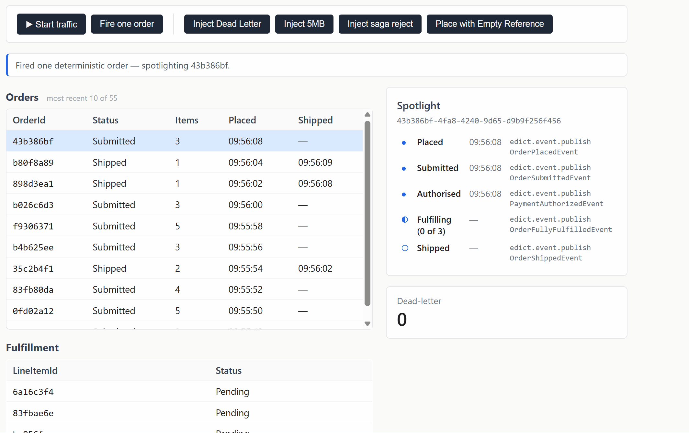
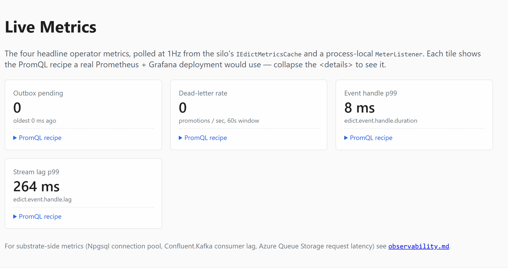

# Edict

[](https://github.com/MalcolmMcNeely/Edict/actions/workflows/ci.yml) [](https://app.codecov.io/gh/MalcolmMcNeely/Edict) [](https://dotnet.microsoft.com/) [](LICENSE)

Edict is a CQRS and event-driven framework for .NET on Microsoft Orleans. You write the handler; Edict absorbs the wiring every team otherwise rewrites by hand, so feature devs can focus on feature code.



New here? Start with [getting started](docs/usage/getting-started.md). Using an AI editor? MCP and skill-bundle setup is in [`docs/usage/agentic/`](docs/usage/agentic/) (only the MCP server auto-wires; the skills are plain markdown any agent can read). Curious how this was built? See [How this was built](#how-this-was-built) below.

```csharp
public partial class OrderCommandHandler : EdictCommandHandler<OrderState>
{
    Task<EdictCommandResult> HandleAsync(PlaceOrderCommand cmd)
    {
        State.Status = OrderStatus.Open;
        Raise(new OrderPlacedEvent(cmd.OrderId));
        return Task.FromResult<EdictCommandResult>(new EdictCommandResult.Accepted());
    }
}
```

Subscribing to that event is just as small:

```csharp
public sealed partial class OrderEmailHandler(IEmailSender email) : EdictEventHandler
{
    Task HandleAsync(OrderPlacedEvent evt) => email.SendConfirmation(evt.OrderId, evt.EventId);
}
```

That's both sides of an event-driven flow. No Orleans interfaces, no stream wiring, no serialization attributes, no DI registration. From those two methods you get:

| Guarantee | What it does |
|---|---|
| **Idempotent** | Redeliveries are deduplicated by `EventId` before `HandleAsync` runs |
| **Atomic** | Aggregate state and raised events commit in a single write |
| **Traced** | One OpenTelemetry trace covers every hop from `SendAsync` to the terminal handler |
| **Forensic** | Poison messages land in a queryable dead-letter projection |
| **At-least-once** | Duplicates and bounded reorder are deterministically exercised in tests |
| **Wired** | Source generators connect `HandleAsync` to its stream by parameter type |

The same handler code runs on either of two reference substrate pairings — Azure Storage, or Kafka + Postgres — both passing the same conformance battery. Substrate-pluggability is demonstrated, not claimed.

## Testing and chaos

Edict ships with an in-memory test framework so command, event, saga, and projection handlers can be exercised without spinning up Orleans, Azurite, or any container. Tests `SendAsync` a command, `Drain` the cascade, and inspect saga progress or projection rows directly.

```csharp
await using var app = await EdictTestApp.StartAsync(b => b
    .WithConsumer(typeof(OrderCommandHandler).Assembly));

await app.SendAsync(new PlaceOrderCommand(orderId, "REF-001"));
await app.SendAsync(new AddLineItemCommand(orderId, Guid.NewGuid(), "SKU-1", 1));
await app.SendAsync(new SubmitOrderCommand(orderId, Amount: 100m));
await app.Drain();

var progress = await app.GetSagaProgress<OrderPaymentSaga, OrderPaymentProgress>(orderId);

await Verify(progress);
```

Three commands flow through a command handler, a saga, and a projection builder — all in-process, no containers — and one Verify snapshot captures the entire outcome.

Chaos is on by default: the in-memory executor models at-least-once delivery — duplicate redelivery and bounded reorder, seeded for determinism — so every test exercises the dedup ring and reorder-tolerance guarantees the production substrate requires. The framework itself is tested against real Azurite via Testcontainers, so the in-memory seam stays honest.

## Why Orleans?

Two pods. Same order. Two writes at once. The conventional answer is a distributed lock — and then a cache-invalidation channel, and then session affinity at the load balancer, and then giving up on in-memory state.

Orleans's answer is one rule: each entity has a single in-memory home — one node, one activation, one thread at a time.

From that one rule:

- **The distributed lock disappears.** Concurrent calls to the same entity queue on the activation; no second writer exists.
- **Cache invalidation disappears.** The activation is the cache. There is no second copy to invalidate.
- **Session affinity disappears.** The runtime routes by entity identity, not by load-balancer configuration.
- **In-memory state stops being a code smell.** Local fields outlive a request because the activation does.

Orleans dissolves the infrastructure tax. It does not dissolve the application-layer tax — idempotency for duplicate deliveries, atomicity between state and events, trace continuity across async hops, forensics for poison messages. That's where Edict comes in.

## Why Edict?

A webhook fires twice. A handler crashes after writing state but before publishing the event. A trace from `SendAsync` dies at the first queue hop. A poison message wedges the aggregate. Conventional .NET answers each with a different library and a fresh row in a fresh table.

Edict answers all four from one place: every consumer inherits a base class that wraps `HandleAsync` in an envelope carrying a dedup key, the trace context, and the outbox commit. Each failure above already has its home there:

- **The double webhook** is deduplicated by `EventId` before `HandleAsync` runs. Idempotency is the default, not an opt-in.
- **The half-finished crash** can't happen: aggregate state and raised events commit in one grain write, with no two-phase commit to stall halfway.
- **The broken trace** stays whole. The envelope carries trace context across every async stream hop, so `SendAsync` to the terminal handler is one OpenTelemetry trace.
- **The poison message** lands in a queryable dead-letter projection. The aggregate keeps accepting commands; the failure has a forensic home instead of a wedged grain.

The consumer-facing surface is seven concepts: **[Command Handler](docs/usage/concepts/commands.md)**, **[Command Validator](docs/usage/concepts/validators.md)**, **[Event Handler](docs/usage/concepts/event-handlers.md)**, **[Saga](docs/usage/concepts/sagas.md)**, **[Projection Builder](docs/usage/concepts/projections.md)**, **[Sender](docs/usage/concepts/commands.md)**, **[Stream](docs/usage/concepts/events.md)**. Everything else is the framework's problem. That matters for AI-assisted development too: a small, well-defined pattern set is easier to compose against than asking an AI to invent a distributed system from scratch every time.

Edict isn't a production framework yet — there are gaps a hardened one would close. But the bet holds: a single programming model is worth more than a polyglot stack pretends, once the framework absorbs the hard parts.

## Multi-tenancy

Edict's multi-tenancy draws one hard line and states both sides of it honestly.

**What Edict guarantees: the Company Wall.** Mark an aggregate's route-key type with `[EdictTenantScoped]` and the tenant is folded into every grain, stream, projection, and audit key. A session resolved as Company A can then only ever address Company A's data. This is structural, not a permission check: reaching another tenant's data is a key that cannot be formed, not a check that might be forgotten. A cross-tenant read comes back empty by construction, a missing tenant fails the send closed, and a stolen-key reach is refused by a runtime call filter. Public and tenant-scoped aggregates coexist in one app.

**What stays yours.** Within-tenant authorization (which user inside Company A may see which row) is your domain layer, untouched by Edict. The map from a logged-in user to their tenant is yours too: you resolve it from a trusted, signed source and hand Edict the tenant id, never reading it off the request body.

One honest asymmetry: Postgres persistence adds Row-Level Security as a defense-in-depth backstop; Azure Table and Blob have no equivalent, so the Azure pairing relies on key composition and the call filter alone. Full detail in [Multi-tenancy](docs/usage/concepts/multi-tenancy.md).

## Agentic tooling

AI-assisted development against Edict isn't guesswork. Same philosophy as the rest of the framework: consumers should be able to use Claude productively against Edict without first writing scaffolding to teach the agent what Edict is. An MCP server (`edict-mcp`) and a Claude Code skill bundle (`edict-skills`) ship from this repo so the agent queries the live solution instead of inventing one:

| Skill (when it fires) | MCP tools it calls | What the agent stops guessing |
|---|---|---|
| **edict-authoring** — adding a handler / saga / projection | `edict_list_handlers`, `edict_list_route_keys`, `edict_describe_glossary_term` | which `RouteKey` Guids are taken, which handlers already exist, what a "Saga" actually means here |
| **edict-silo-wiring** — touching any `AddEdict*` call | `edict_describe_silo_wiring` | which substrate is wired in `Program.cs`, which extensions are missing |
| **edict-contracts** — attribute or wire-format questions | `edict_describe_glossary_term`, `edict_lookup_adr` | what a `Stream` is, why `[Union]` is banned (with the source ADR) |
| **edict-diagnostics** — debugging dead-letter / outbox / traces | `edict_lookup_adr` | why the framework behaves the way it does, with the decision record attached |
| **edict-testing** — writing tests against `EdictTestApp` | (prose-only) | how to drain the cascade, which probe to use for sagas vs projections |

Dev-loop walkthrough — install, when each skill fires, which MCP tool it calls, what the agent sees — lives under [`docs/usage/agentic/`](docs/usage/agentic/).

Install instructions: [`Edict.Mcp`](Edict/Edict.Mcp/README.md), [`Edict.ClaudeSkills`](Edict/Edict.ClaudeSkills/README.md).

## Benchmarks

`Edict.Benchmarks.Throughput` sweeps issuer parallelism against any registered substrate (`azure`, `kafkapostgres`, or `all`) and writes results to [`docs/benchmarks/`](docs/benchmarks/).

- [`throughput.md`](docs/benchmarks/throughput.md) — measured per-event latency and sustained EPS on both substrates, framed as a regression guard on a known substrate, not a sizing tool.
- [`production-scale-estimate.md`](docs/benchmarks/production-scale-estimate.md) — back-of-envelope extrapolation to real Azure Storage and managed Kafka + Postgres at 1/2/4/8 silos, with substrate ceilings and the assumptions worth pressure-testing.

## Tech stack

C# / .NET 10, Microsoft Orleans, OpenTelemetry, Roslyn source generators + analyzers, .NET Aspire, xUnit + Verify + Testcontainers.

**Technology plugins** — same domain code, one conformance battery:

| Pairing          | Streaming    | State + projections |
| ---------------- | ------------ | ------------------- |
| Azure Storage    | Azure Queue  | Azure Table + Blob  |
| Kafka + Postgres | Apache Kafka | PostgreSQL          |

## Highlights

- **Agentic-friendly.** An MCP server and Claude Code skill bundle let consumers use Claude against Edict without first teaching the agent how it works.
- **Pluggable.** Same handlers on Azure Storage or Kafka + Postgres.
- **Event-driven, not event-sourced.** Events are transient; grain state is snapshot-persisted by Orleans.
- **Atomic state + events.** One grain write covers both.
- **Read-your-writes.** A command returns a cursor; a query with `after:` waits until that write is visible, so a user reliably sees their own change.
- **Projection species.** Two builders over one root: in-grain state for small, hot, per-id read models; an external list for large or unbounded ones.
- **Effectively-once.** Per-consumer dedup in the base class.
- **Multi-tenant by structure.** Mark a route-key type tenant-scoped and the tenant folds into every key; a session can only ever address its own tenant's data. Within-tenant authorization stays yours.
- **Retries that don't block.** Failing outbox entries back off independently.
- **Claim check.** Large payloads spill to blob storage; the wire format carries a pointer.
- **One trace per business flow.** Trace context follows every async stream hop.
- **Operational metrics.** Outbox depth and age, dead-letter rate, handler p99, stream lag, saga age, and claim-check size on one `Meter` named `"Edict"`, with PromQL alert recipes in [`docs/operations/alerts.md`](docs/operations/alerts.md).
- **Dead-letter as observability.** Permanently failing effects land in a queryable projection.
- **Regulator-grade audit log.** Opt in, and every command decision (accept *and* reject) and raised event is captured under an authenticated principal to a tamper-evident WORM store, committed atomically with the action and proven unaltered by a per-aggregate hash chain.
- **Saga timeouts.** Every saga has an absolute lifetime cap (7-day default, overridable or opt-out); on expiry it runs a compensation hook and dead-letters, so a stalled workflow stays bounded, not immortal.
- **In-grain durable scheduling.** A handler or saga schedules recurring work from inside `HandleAsync` in one line; the schedule persists a message (never a delegate), survives deactivation, and catches up on reactivation.
- **Configurable.** Every knob is an options property with a default and startup validation.
- **In-memory tests.** SendAsync → drain → verify without containers; the framework itself is tested against real Azurite via Testcontainers.

## What's next

- **Outbox circuit breaker.** Per-target breaker on the executor seam, so a flapping downstream stops getting hammered by per-entry retries.
- **External-work primitive.** Dispatch a slow out-of-grain operation (API call, batch job, external process), park via reminder, resume with the result to issue a command. Orleans grain turns should stay short, and there is no framework-shape way to do this today.
- **More substrates.** AWS SQS + DynamoDB. NATS JetStream. Cosmos DB. MongoDB. The conformance harness already exists, so the next substrate add is mostly a queue adapter and a state-storage provider: no public-API changes, and provider-specific fault classification is a registered extension point.

## Running locally

You'll need .NET 10 and Docker.

```bash
git clone https://github.com/MalcolmMcNeely/Edict.git
cd Edict
dotnet run --project Sample/Sample.Azure.AppHost
```

The Aspire dashboard prints a URL on startup. From there, follow two links:

- **Sample.Azure.Web** — a believable commerce console with six views: **Dashboard** (live order traffic, the order spotlight, a fault-injection panel, fire-one-order, and the dead-letter counter), **Checkout** (cart to order through a bridge saga, with read-your-writes on the checkout click), **Orders** (drive one order's lifecycle, payment compensation, and the notifications panel), **Schedules** (reservation holds, delivery ETA, gateway settlement), **Operations** (metrics and dead-letter RCA), and **Audit Log** (act as a chosen principal, drive an accepted or rejected order, and read back the attributed, tamper-evident decision chain from the WORM store). Press ▶ on the Dashboard to start traffic, or press **Fire one order** for a single deterministic lifecycle that produces one clean trace tree in Aspire.
- **Aspire telemetry** — the trace view is the source of truth for what Edict is actually doing. Look for spans named `edict.command.send`, `edict.event.publish`, and `edict.event.handle`. Oversize events carry `envelope.shape=ClaimCheck` on the publish span.

Each view names the Edict concept it exercises and links to its concept doc. The framing rationale, plus a feature-to-walkthrough-to-test index, lives in [`docs/usage/sample.md`](docs/usage/sample.md); the use-case-to-test map lives in [`docs/usage/testing/sample-map.md`](docs/usage/testing/sample-map.md).



Run the test suites with `dotnet test Edict/Edict.slnx`. On Windows, enable long paths first: `git config core.longpaths true`.

### Running on Kafka + Postgres

The same sample domain runs on Kafka and PostgreSQL — same handlers, same conformance scenarios, different substrate.

```bash
dotnet run --project Sample/Sample.KafkaPostgres.AppHost
```

Aspire brings up Kafka, Postgres, the silo, and the web tier. Kafka UI and pgAdmin sidecars are wired in for topic and table inspection.

## How this was built

Edict was/is built using an AI-assisted workflow loosely modelled on [Matt Pocock's skills](https://github.com/mattpocock/skills) — a set of Claude Code skills that drive a disciplined PRD-then-TDD loop instead of free-form prompting. Each feature starts as a PRD on the [issue tracker](https://github.com/MalcolmMcNeely/Edict/issues), gets broken into tracer-bullet vertical slices, and lands via the red-green-refactor TDD skill. The whole decision trail is visible there: PRDs, slice issues, and the conversations that shaped each one.

Domain language lives in [`CONTEXT.md`](CONTEXT.md). Every load-bearing decision is recorded in [`docs/adr/`](docs/adr/).
