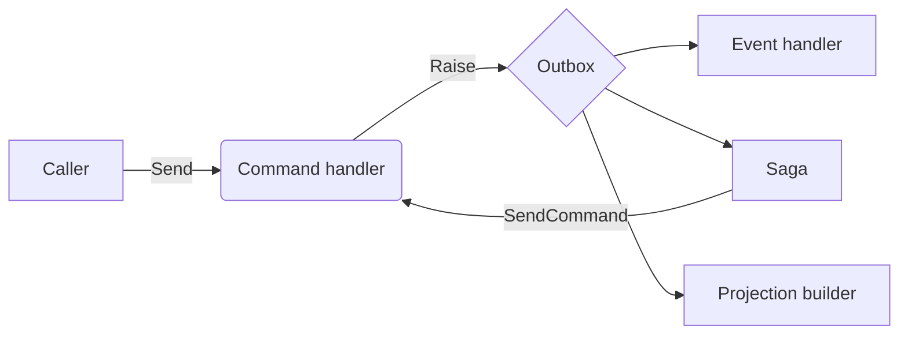

# Hello, Edict

> *"Most of my career was making things the same."*

A staff engineer I worked with said that to me once. He was talking about a different framework at the time, but it was exactly the kind of problem **Edict** solves. That conversation stuck. It was a big driver in building this.

Edict is a CQRS framework for .NET on top of Microsoft Orleans. It absorbs the plumbing every event-driven team rewrites by hand: idempotency keys for at-least-once redeliveries, an outbox for atomic state and events, trace propagation across stream hops, a queryable dead-letter projection.

I built it in two weeks. Claude wrote almost every line of code; I drove the design, reviewed every change, and corrected course when needed.

This post is the short tour. What it does, how it was built, whether it's worth your time.

## How this was built

Two weeks of focused sessions, almost entirely agentic. Claude wrote the code; I drove the design and reviewed every change.

The workflow was loosely modelled on [Matt Pocock's skills](https://github.com/mattpocock/skills): each feature began as a PRD on the issue tracker, got broken into vertical slices, and landed via red-green-refactor TDD. Domain language lives in `CONTEXT.md`; load-bearing decisions live in ADRs. Whenever I caught myself making the same correction twice, I codified it as a project skill or analyzer.

This is not "look what AI can do alone." Claude is a powerful implementation surface but it needed a human with strong architectural opinions and a clear domain language to be useful. This is what agentic development looks like when the human has done the design work.

## The problem

[Microsoft Orleans](https://learn.microsoft.com/en-us/dotnet/orleans/) is great. It gives you a programming model where every entity in your system has exactly one in-memory home, on one node, on one thread at a time. The whole class of *"two pods, same order, race condition"* problems just disappears.

But Orleans is a runtime, not an opinion. The moment you want CQRS, event-driven flows, sagas, projections, or an outbox, you start writing the same plumbing every team writes:

- Idempotency keys for at-least-once redeliveries
- Trace propagation across async stream hops
- Atomic commit of state *and* the events you raised
- A dead-letter table for the poison message that just took out your aggregate

None of it is hard. All of it is repetitive. And most teams get at least one of them subtly wrong.

Edict's bet is that this is a framework's job, not yours.

## What it feels like

A command handler is one method:

```csharp
public partial class OrderCommandHandler : EdictCommandHandler<OrderState>
{
    public Task<EdictCommandResult> HandleAsync(PlaceOrderCommand cmd)
    {
        State.Status = OrderStatus.Open;
        Raise(new OrderPlacedEvent(cmd.OrderId));
        return Task.FromResult<EdictCommandResult>(new EdictCommandResult.Accepted());
    }
}
```

A validator that gates that handler is one constructor:

```csharp
public sealed class OrderPlaceCommandValidator : EdictCommandValidator<PlaceOrderCommand>
{
    public OrderPlaceCommandValidator() =>
        RuleFor(x => x.CustomerReference).NotEmpty().WithErrorCode("customer_reference_required");
}
```

It runs in the same activation turn as the handler, before `HandleAsync`. A failure short-circuits to `EdictCommandResult.Rejected` with `customer_reference_required` as the rejection code; the handler never sees an invalid command and no state mutation occurs.

An event handler is also one method:

```csharp
public sealed partial class OrderEmailHandler(IEmailSender email) : EdictEventHandler
{
    public Task HandleAsync(OrderPlacedEvent evt) => email.SendConfirmation(evt.OrderId, evt.EventId);
}
```

Both sides of an event-driven flow. No Orleans interfaces. No stream wiring. No serialization attributes. No idempotency code. Source generators connect `HandleAsync` to the right stream based on its parameter type, and the base class deduplicates redeliveries by `EventId` before ever calling you.

## The whole vocabulary

There are six things you write. That's it.

| Concept | What you write |
|---|---|
| **Command handler** | The aggregate's invariant. Receives a command, mutates state, raises events. |
| **Event handler** | A side effect. Receives an event, does something (send email, call API). |
| **Saga** | A long-running coordinator. Reacts to events, sends commands. |
| **Projection builder** | A read model. Receives events, writes a queryable row. |
| **Sender** | How callers reach into the system to issue a command. |
| **Stream** | A topic identity. Where events flow. |

Everything else is the framework's problem: routing, serialization, the outbox, retries, dead-lettering, tracing, the parts of Orleans you'd rather not type.

## The flow end to end



One OpenTelemetry trace covers the whole graph. If any handler throws, the failure lands in a dead-letter projection you can query. The aggregate keeps accepting commands.

## Pick your substrate

The same handler code runs on either of two reference pairings, both passing the same conformance battery:

| Substrate | Streaming | State |
|---|---|---|
| **Azure** | Azure Queue Storage | Azure Table Storage |
| **Kafka + Postgres** | Apache Kafka | PostgreSQL |

Adding a third is a matter of implementing the substrate seam. The framework itself doesn't care which queue or store sits underneath.

## Testing without containers

Edict ships an in-memory test app so you can exercise an entire command → event → saga → projection flow in-process. No Orleans cluster, no Azurite, no Docker. Three lines:

```csharp
await using var app = await EdictTestApp.StartAsync(b => b
    .WithConsumer(typeof(OrderCommandHandler).Assembly));

await app.SendAsync(new PlaceOrderCommand(orderId, "REF-001"));
await app.Drain();

await Verify(await app.GetSagaProgress<OrderPaymentSaga, OrderPaymentProgress>(orderId));
```

**Chaos is on by default.** Duplicate redeliveries and bounded reorder are simulated deterministically, so every test you write exercises the at-least-once guarantees production has to tolerate. No setup required.

## AI-assisted development, built in

Edict's whole philosophy is that the framework should absorb the things every team rewrites by hand, so feature devs can focus on feature code. The MCP server and Claude Code skill bundle that ship with Edict apply that same principle to AI tooling: consumers should be able to use Claude productively against Edict without first writing scaffolding to teach the agent what Edict is.

Ask Claude *"where does `PlaceOrderCommand` get routed?"* and it calls `edict_describe_silo_wiring` instead of guessing from grep results. Ask it to add a saga and it calls `edict_list_route_keys` to find unused Guids before writing one. Ask it why a dead-letter behaves a particular way and it calls `edict_lookup_adr` and returns the source decision.

The two pieces:

- **`edict-mcp`** is an MCP server that exposes six tools the agent can call against your live solution
- **`edict-skills`** is a Claude Code skill bundle that knows *when* to call each tool

Together they mean the agent works from your actual code, not from a guess about what an event-driven framework probably looks like:

| Skill (when it fires) | What the agent stops guessing |
|---|---|
| **edict-authoring** (adding a handler, saga, or projection) | Which `RouteKey` Guids are taken, which handlers already exist |
| **edict-silo-wiring** (touching any `AddEdict*` call) | Which substrate is wired in `Program.cs`, which extensions are missing |
| **edict-contracts** (attribute or wire-format questions) | What a `Stream` is, why `[Union]` is banned (with the source ADR) |
| **edict-diagnostics** (debugging dead-letter, outbox, or trace issues) | Why the framework behaves the way it does, with the decision record attached |

I think this is going to matter more over the next year, not less. The frameworks that work well with AI tools are the ones that tell the agent the truth about themselves. That's a lot easier to do for the framework author than for every consumer team to invent on their own.

## When it fits

Edict is probably worth a look if:

- You're already on Orleans, or you've been weighing it up
- You want CQRS and event-driven flows without handwriting the plumbing
- You like writing C# and want one programming model across every entity in the system
- You're curious what agentic development can produce when the human in the loop knows the design space cold

It's probably **not** for you if:

- A REST API over EF Core is enough. You genuinely don't need this.
- You can't move to .NET 10
- You need a battle-tested production framework today. Edict is portfolio quality. The design is solid and the test coverage is real, but no one is running it at a Fortune 500 yet, including me.

I'd rather you know that up front than find out later.

## Try it

- **Repo:** https://github.com/MalcolmMcNeely/Edict
- **Getting started:** [`docs/usage/getting-started.md`](usage/getting-started.md)
- **The Sample app:** clone the repo, run the Aspire AppHost, and watch commands flow through to a Blazor dashboard in real time
- **The reasoning:** every non-obvious design decision lives in [`docs/adr/`](adr/)

If you spot something missing, surprising, or wrong, a GitHub issue is the fastest way to reach me. I'm also on LinkedIn.

Thanks for reading.
